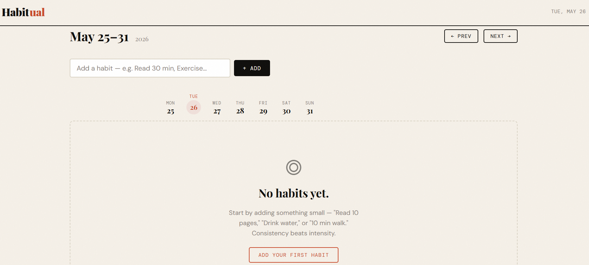
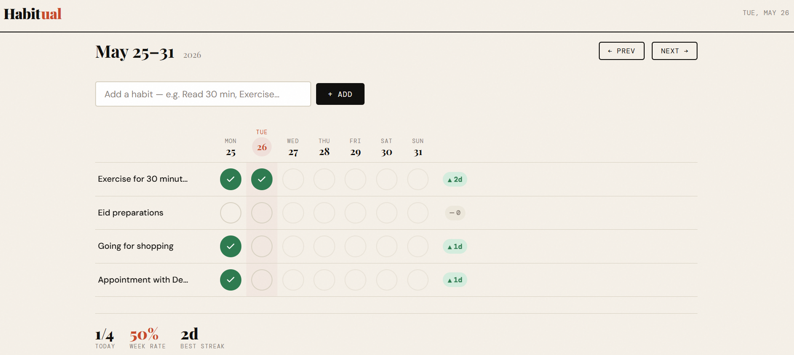

# Habitual - Daily Habit Tracker

A clean, focused single-page habit tracker built with vanilla HTML, CSS, and JavaScript. No build step, no dependencies, no frameworks, just open and go.

## How to Run

**Option A: Open directly (simplest):**
```
Open index.html in any modern browser (Chrome, Firefox, Safari, Edge)
```

**Option B: Local dev server (avoids any browser file:// restrictions):**
```bash
# Python 3
python3 -m http.server 8080
# Then visit: http://localhost:8080

# Or with Node.js (npx, no install needed)
npx serve .
# Then visit the URL it prints
```

No npm install, no build, no config. Clone the repo and open the file.

**Deployed URL:** *(https://habbittrackr.netlify.app/)*

---

## Project Structure

```
habit-tracker/
├── index.html     # Entire app: HTML, CSS, JS in one file
├── README.md
└── ANSWERS.md
```

## Features

- Add, rename (click any habit name), and delete habits
- Weekly grid: habits × days, with today's column highlighted
- Toggleable checkmarks with satisfying pop animation
- Streak counter per habit (🔥 for 7+ day streaks)
- Week navigation: previous, next, jump to current
- Past weeks show historical data; future days are disabled
- Summary bar: today's completion, weekly rate, best streak
- Persists everything to `localStorage` across reloads
- Responsive from 360px phones to 1440px+ desktops
- Keyboard accessible throughout

---

## 🖼️ UI Screenshots

### 🌱 Empty State — Getting Started


### ✅ Habit Grid: Weekly Tracking View



